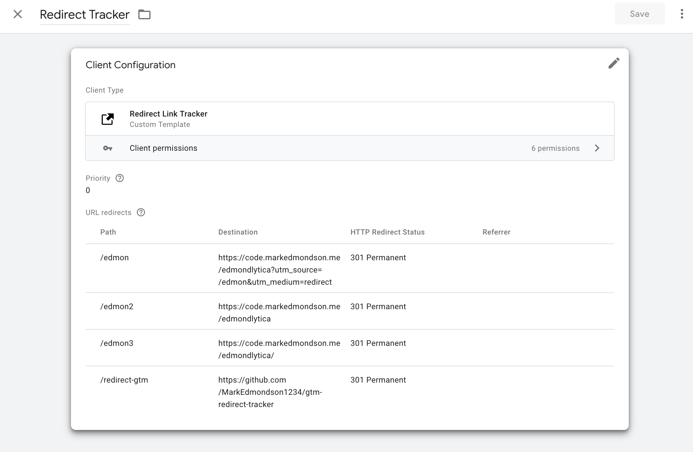
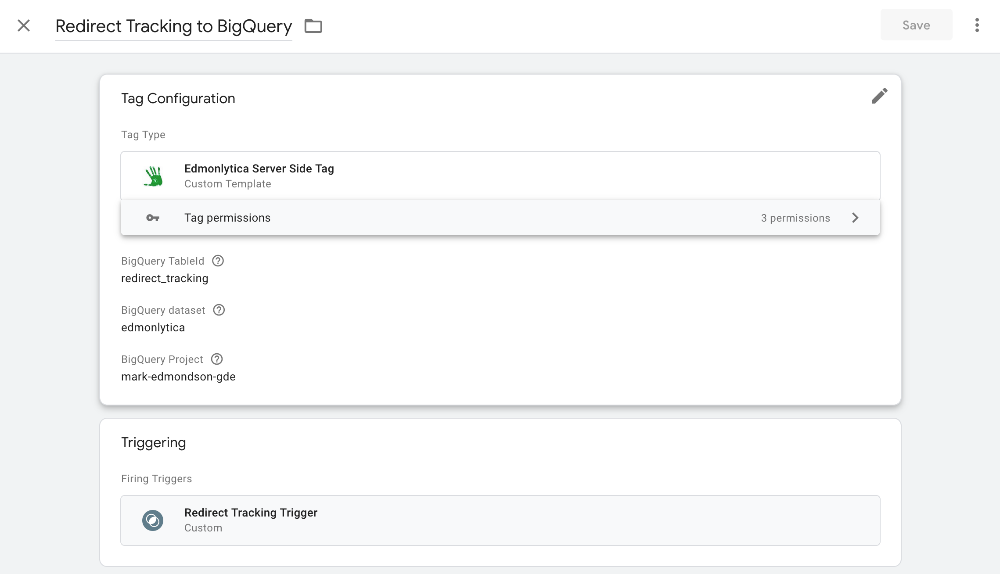
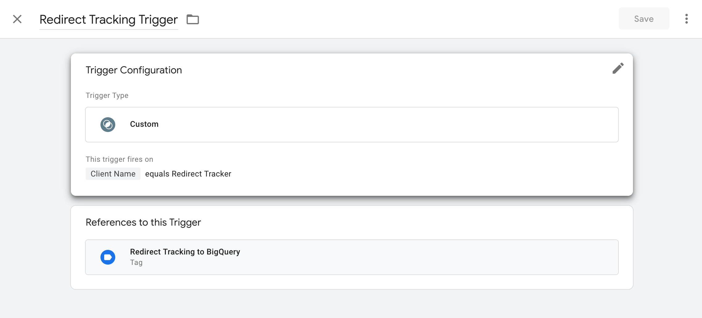

# Google Tag Manager Server Side - Redirect Tracker

This GTM SS Client lets you track URLs via redirects.

## Configuration

You have these fields to configure:

* Path - the path pointing at your GTM Server Side domain e.g. if your GTM SS is at `https://gtm.example.com/` then use `/path1` so `https://gtm.example.com/path1` will be a redirect tracker
* Destination - where the redirect will end up.  You can use any URL you like, including adding tracking parameters
* HTTP Redirect Status - choose between 301 or 302 redirects
* Referrer - you can overwrite the referrer of the redirect

## GTM Event

The redirect tracker also creates a GTM event with these attributes that you can use to trigger server-side tags:

```js
    const event = {
      event_name: 'redirect',
      redirect_source: row.path,
      redirect_destination: row.redirect,
      redirect_type: row.status,
      redirect_referer: row.referer,
      ts: getTimestampMillis()
    };
```

## Example



In the above screenshot calls to `https://gtm2.markedmondson.me` + ... = 

* `/edmon` redirects to the website with UTM paramters attached
* `/edmon2` and `/edmon3` redirects without UTM parameters
* `/redirect-gtm` redirects to this GitHub container

This client has also been attached to a tag that reads the GTM event and sends it to BigQuery:


